# File Download Service

使用 MinIO 儲存和分享檔案，配合 Elasticsearch、Grafana 統計下載次數
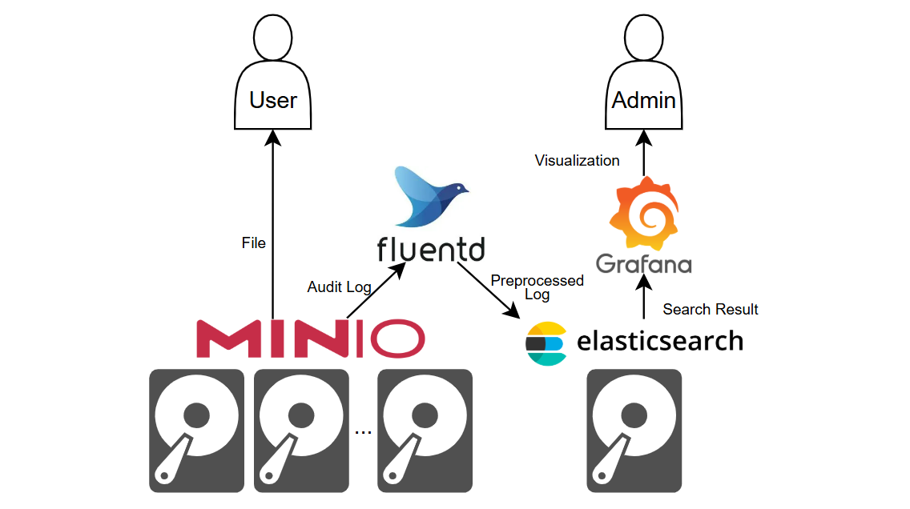

- 上傳、下載檔案
- 產生有時限的下載連結
- 統計每個檔案的下載次數

## 系統需求

- 安裝 Docker、Docker Compose
- 至少 4GB 可用的記憶體
- Port 3000, 9000, 9001 可用
  - 修改 docker-compose.yml 可改用其他 port

## 部署

```bash
git clone https://github.com/PinJhih/file-download-service.git && \
  cd file-download-service && \
  docker compose up -d
```

### 關閉服務

```bash
docker compose down
```

- 關閉服務並移除所有資料
  ```
  docker compose down -v
  ```

## 上傳檔案並分享

打開 http://\<server-ip\>:9001，進入 MinIO 的介面

- 預設帳號: admin
- 預設密碼: admin123
- 帳號密碼可以在 docker-compose.yml 修改
  

首次使用要先建一個 bucket
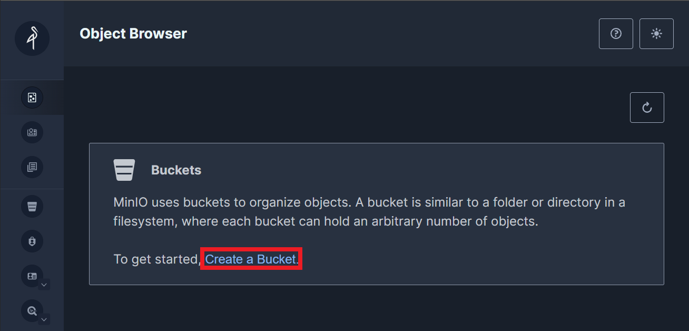

Bucket 名稱可以任意命名 (這邊我命名為 demo)
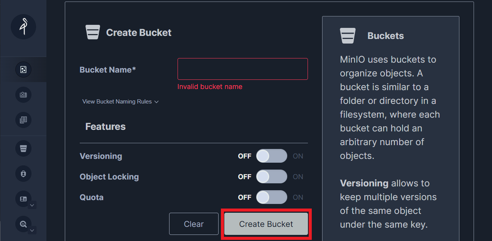

點右側的 Object Browser，選擇剛剛建立的 bucket
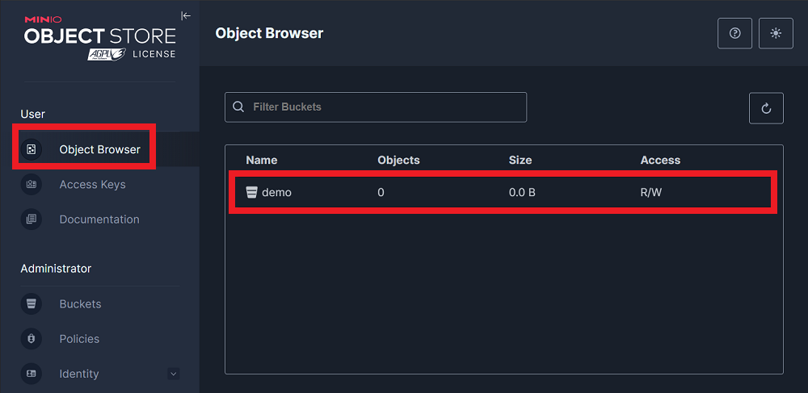

點 Upload，可以上傳檔案或整個資料夾 (也可以同時上傳多個檔案)
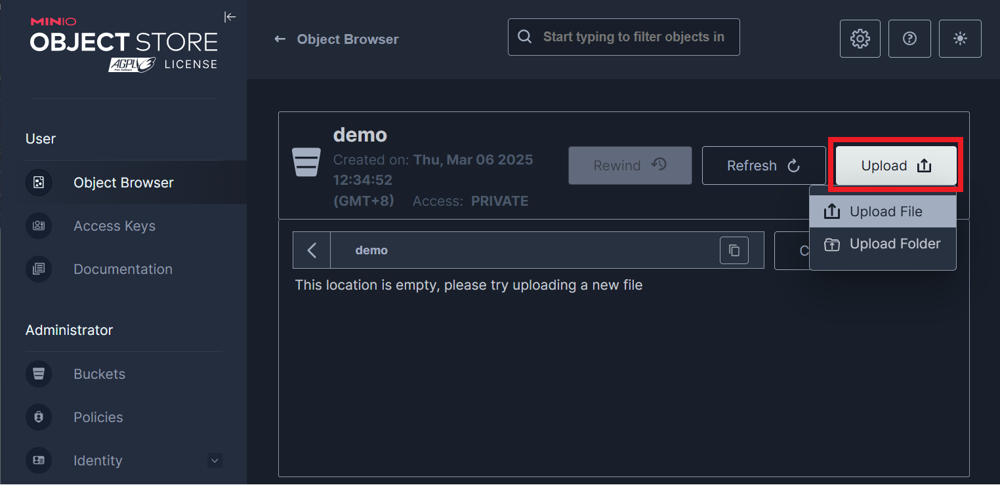

點選要分享出去的檔案，按 share
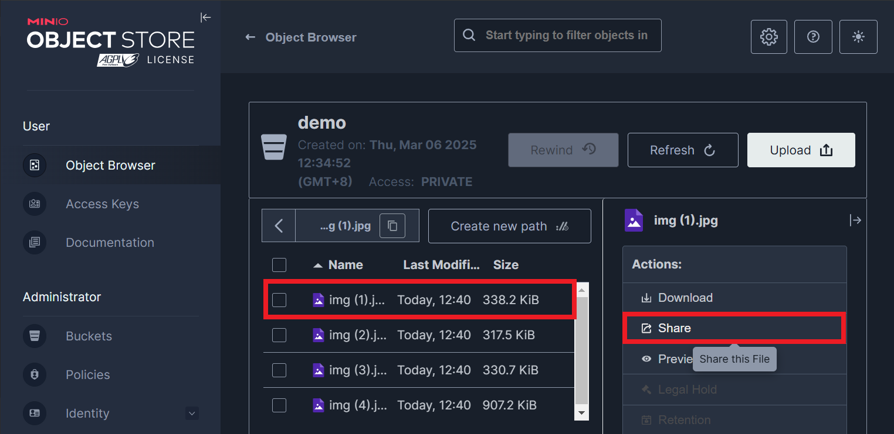

可以設定連結過期的期限，外部使用者可透過此連結下載檔案，且不需要登入 MinIO
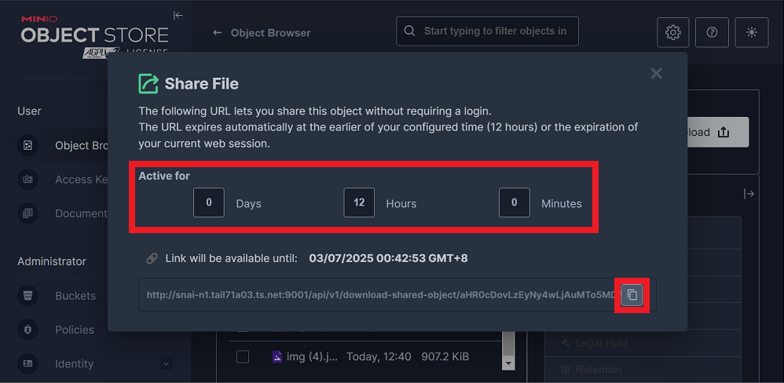

## Dashboard (下載次數統計)

打開 http://\<server-ip\>:3000，進入 Grafana 的介面

- 預設帳號: admin
- 預設密碼: admin123
- 帳號密碼可以在 docker-compose.yml 修改
  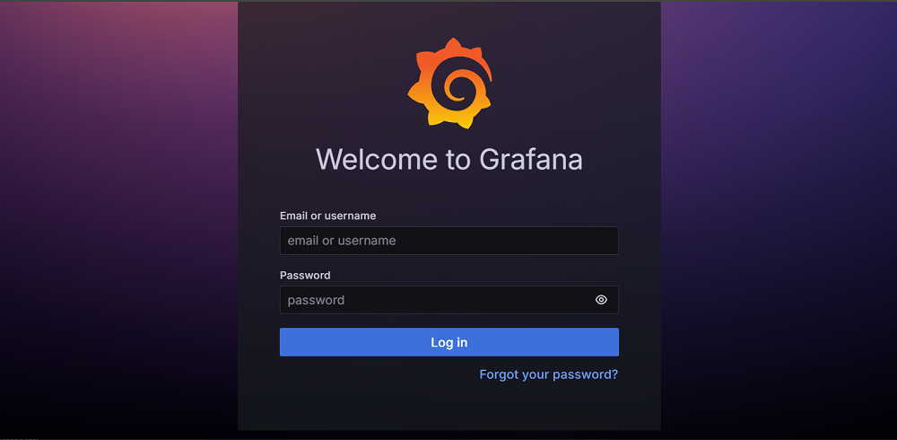

點右上角 logo 展開選單
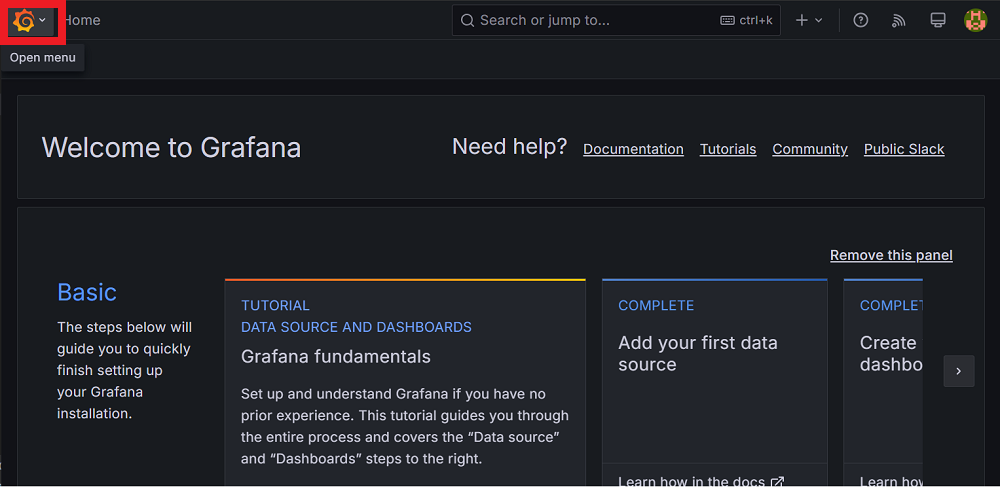

選擇 Dashboards
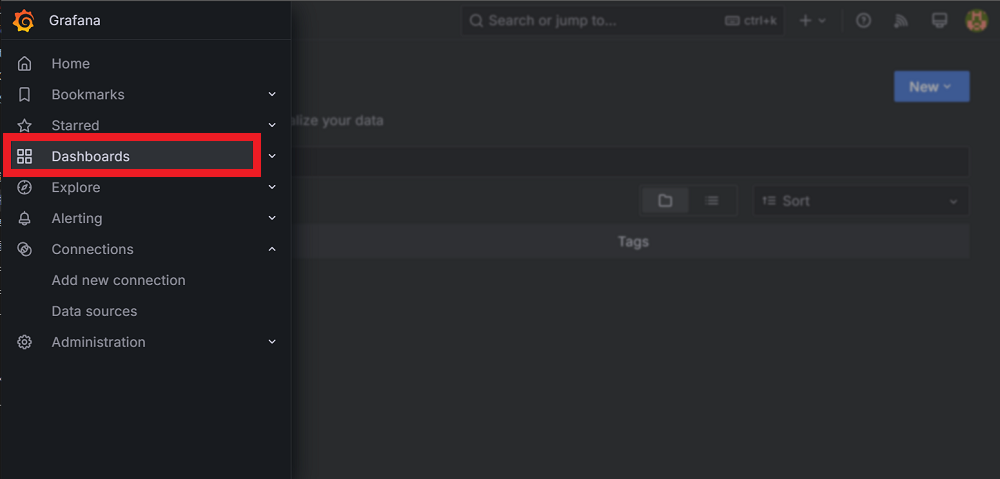

打開 Lab447
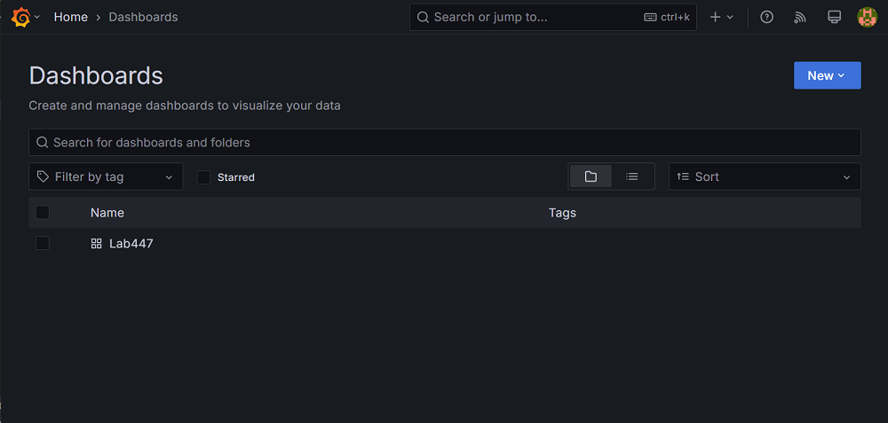

可以看到每個檔案的下載次數統計
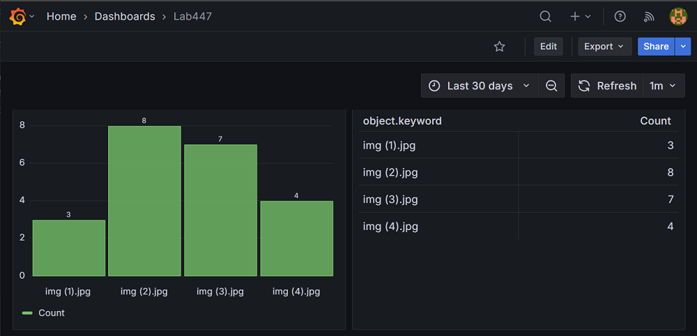

### 故障排除

- 首次進入 dashboard 可能會顯示抓不到資料，原因包含
  - 尚未產生任何下載 log (無 log 資料時 Grafana 的 bug)
  - Grafana UI 不同步
- 可以先用前面 MinIO 產生的連結下載一次檔案，產生一筆 log
- 再手動進入每個 panel 中更新顯示資料

點每個 panel 右上的選單，選 edit
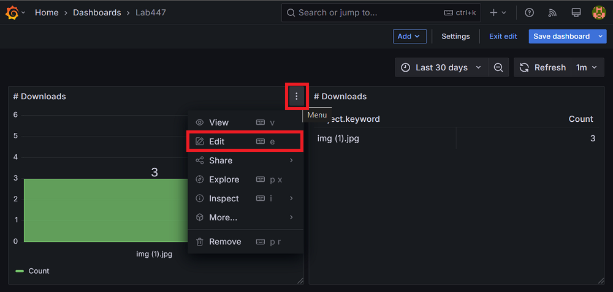

點 refresh 重新整理
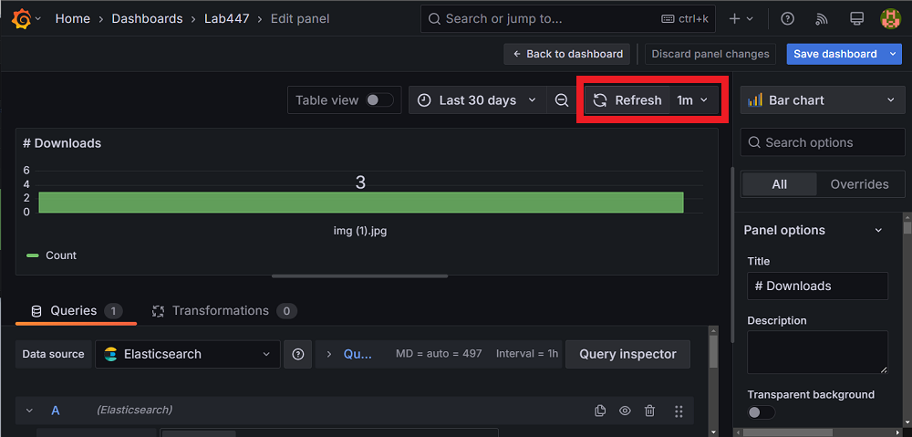

## 系統架構

包含四個 container
- MinIO: 提供穩定、高效且可擴展的物件存儲、檔案分享功能
- Fluentd: 收集 MinIO 的 audit log，過濾、轉換格式後傳送給 Elasticsearch
- Elasticsearch: 儲存 log，並提供查詢、分析的功能
- Grafana: 將 Elasticsearch 中的資料視覺化，並顯示每個檔案的下載次數

### 設定檔

- Fluentd 和 Grafana 需要掛載自定義的設定檔
- 放在 fluent/ 和 grafana/，會在 compose 啟動的時候掛載到對應的容器

### Volumes

- Grafana、MinIO、Elasticsearch 儲存的資料會放在 docker 的 named volume 中
