# File Download Service

使用 MinIO 儲存和分享檔案，搭配 Elasticsearch、Grafana 統計下載次數

- URL Generator 管理和產生下載連結
- Shorten Proxy 轉換短網址和 MinIO 實際網址

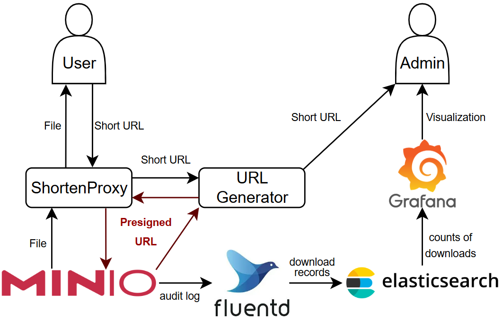

- 上傳、下載檔案
- 產生有時限、且長度短的下載連結
- 統計每個檔案的下載次數

## 系統需求

- 安裝 Docker、Docker Compose
- 至少 4GB 可用的記憶體
- Port 3000, 9000, 9001, 9002 可用
  - 修改 docker-compose.yml 可改用其他 port

## 部署

```bash
git clone https://github.com/PinJhih/file-download-service.git && \
  cd file-download-service
```

### 進行必要設定

- 打開 docker-compose.yml，對以下容器的環境變數做必要的設定
- **MinIO**: 預設帳號/密碼較簡單，建議改成更複雜的組合
  ```yaml
  minio:
  image: minio/minio
  container_name: minio
  ports:
    - "9000:9000"
    - "9001:9001"
  volumes:
    - minio_data:/data
  environment:
    # 修改這兩行以設定管理員的帳號/密碼
    - MINIO_ROOT_USER=admin
    - MINIO_ROOT_PASSWORD=admin123
    ...
  ```
- **short-proxy**: 使用者透過這個服務下載檔案，請將 BASE_URL 修改成要公開給使用者的 domain name
  ```yaml
  shorten-proxy:
    build: ./shorten-proxy/
    container_name: shorten
    ports:
      - "9003:9000"
    command: npm run start
    environment:
      # 將這個 URL 修改成公開給使用者的 domain name 或 IP (若有設定 https 請加上 https)
      - BASE_URL=http://<YOUR DOMAIN NAME>
  ```
- **url-generator**: 此服務會存取 MinIO Server，需要將前面設定的帳號/密碼設定在這個服務的環境變數
  ```yaml
  url-gen:
  build: ./url-generator/
  container_name: urlgen
  ports:
    - "9002:9002"
  command: python3 app.py
  environment:
    # 請勿修改 MINIO_ENDPOINT
    - MINIO_ENDPOINT=minio:9000
    # 設定 MinIO 的帳號/密碼
    - MINIO_ACCESS_KEY=admin
    - MINIO_SECRET_KEY=admin123
    # 設定要使用的 Bucket 名稱
    - MINIO_BUCKET=file-download
  depends_on:
    - shorten-proxy
  ```

### 啟動服務

```bash
docker compose up -d
```

### 關閉服務

```bash
docker compose down
```

- 關閉服務並移除所有資料
  ```
  docker compose down -v
  ```

## 上傳檔案

打開 http://\<server-ip\>:9001，進入 MinIO 的介面

- 預設帳號: admin
- 預設密碼: admin123
- 帳號密碼可以在 docker-compose.yml 修改
  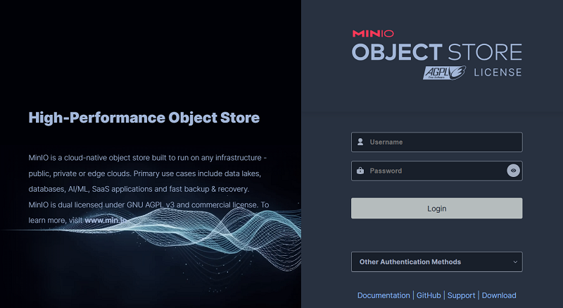

若沒有任何 bucket，要先建一個 bucket
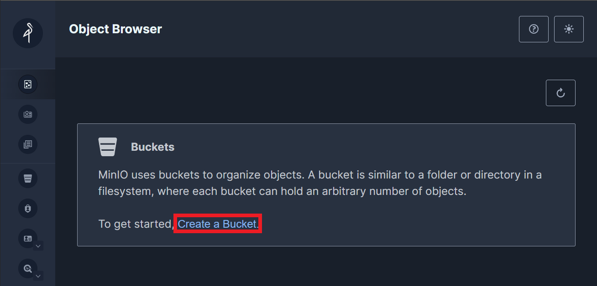

Bucket 名稱可以任意命名 (這邊我命名為 demo)
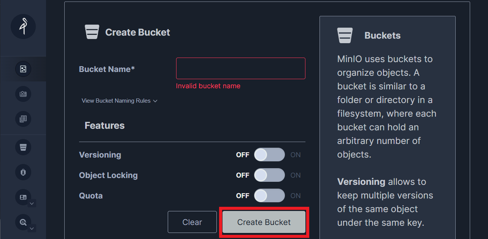

點左側的 Object Browser，選擇剛剛建立的 bucket
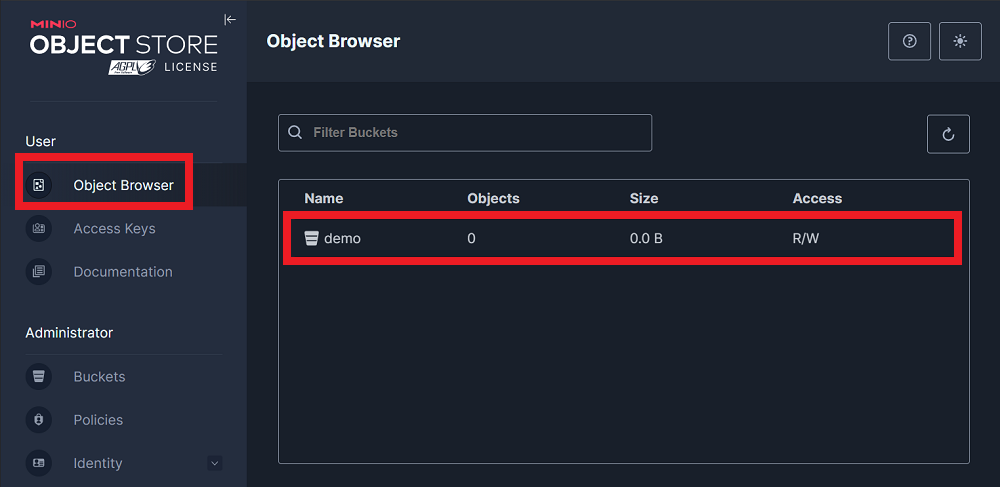

點 Upload，可以上傳檔案或整個資料夾 (也可以同時上傳多個檔案)
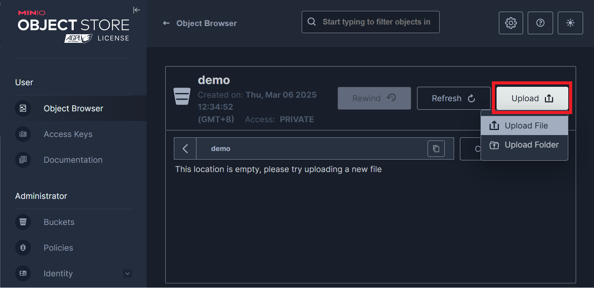

<!-- 點選要分享出去的檔案，按 share
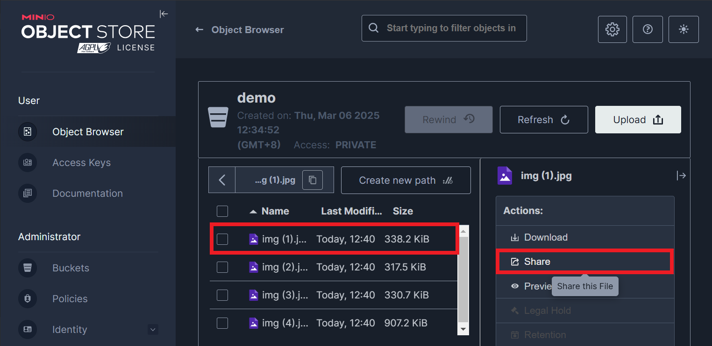

可以設定連結過期的期限，外部使用者可透過此連結下載檔案，且不需要登入 MinIO
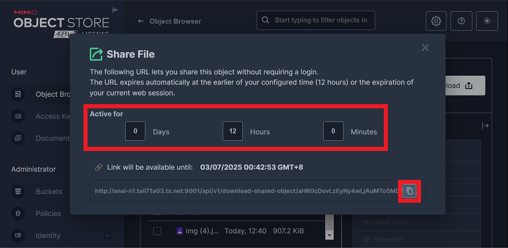 -->

## 產生下載連結

打開 http://<server IP\>:9002，可以看到 bucket 中的所有檔案
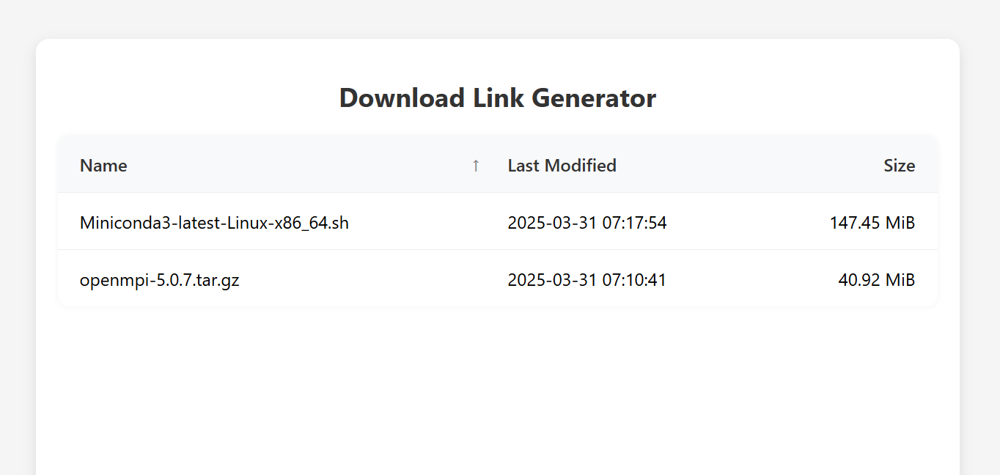

點選要分享的檔案，設定有效期限並產生下載連結
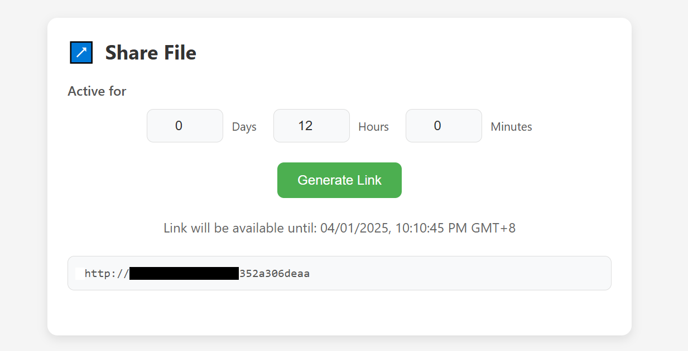

## Dashboard (下載次數統計)

打開 http://\<server-ip\>:3000，進入 Grafana 的介面

- 預設帳號: admin
- 預設密碼: admin123
- 帳號密碼可以在 docker-compose.yml 修改
  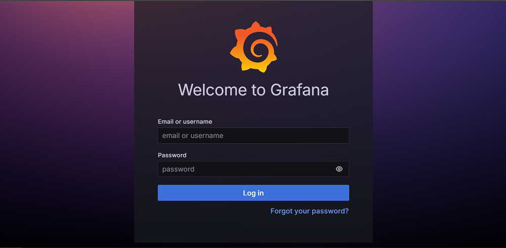

點左上角 logo 展開選單
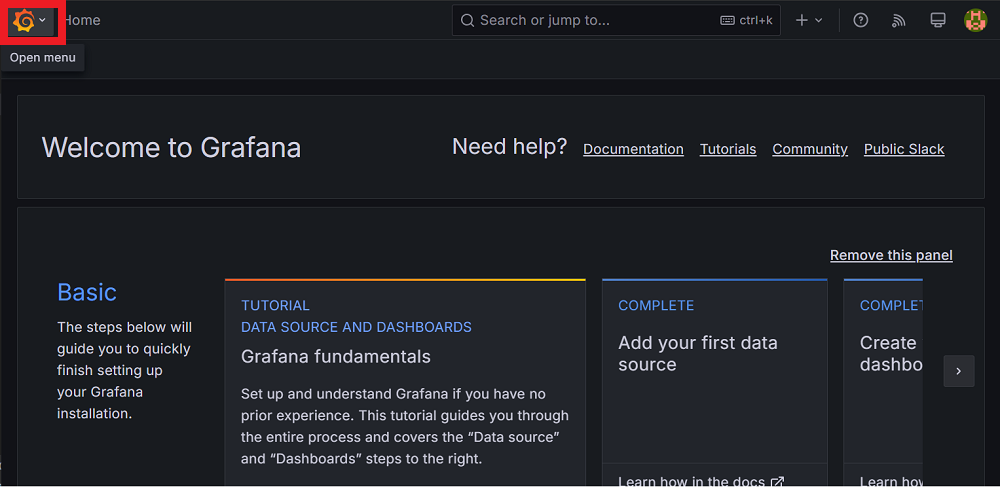

選擇 Dashboards
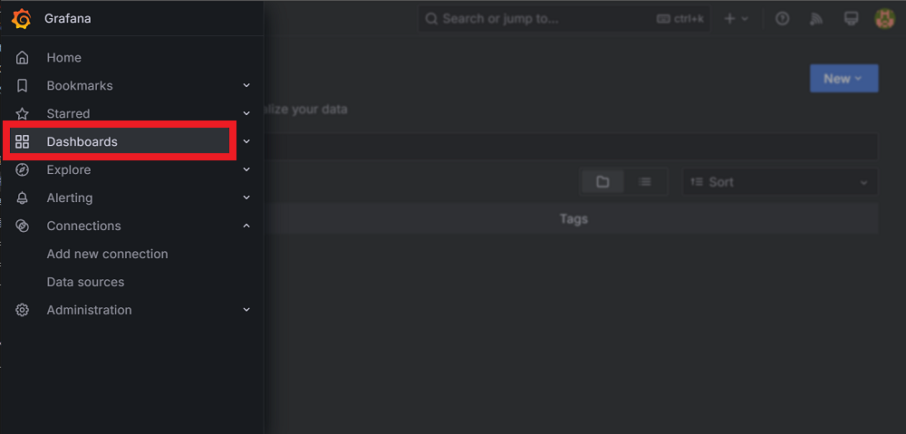

打開 Lab447
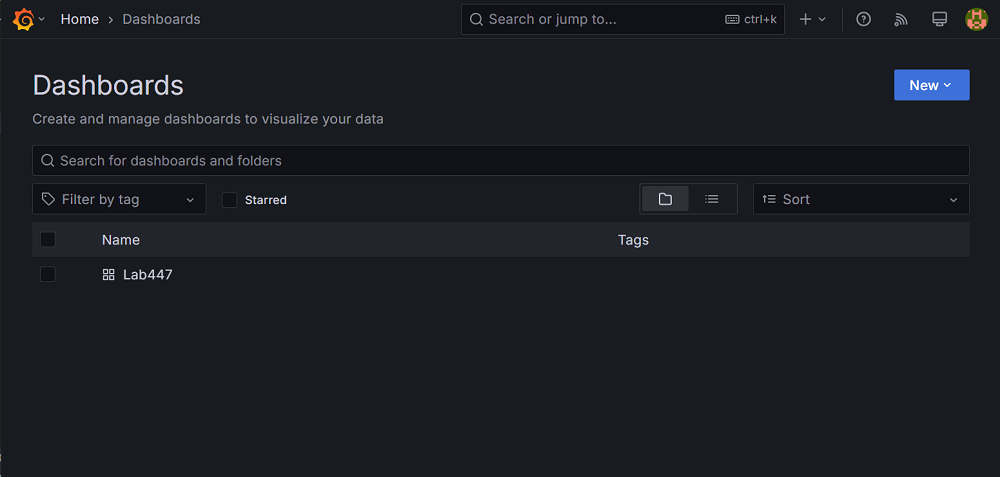

可以看到每個檔案的下載次數統計
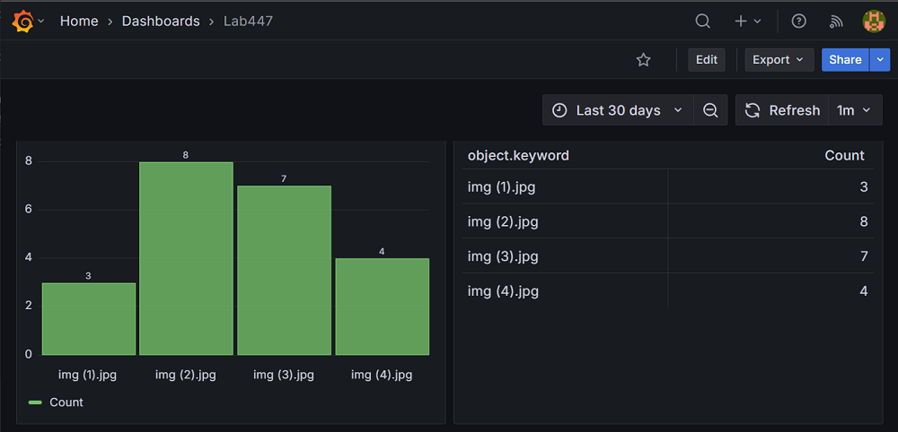

### 故障排除

- 首次進入 dashboard 可能會顯示抓不到資料，原因包含
  - 尚未產生任何下載 log (無 log 資料時 Grafana 的 bug)
  - Grafana UI 和資料庫不同步
- 可以先用前面 MinIO 產生的連結下載一次檔案，產生一筆 log
- 點右上角 refresh

## 系統架構

包含六個 container，其中四個開源工具:

- MinIO: 提供穩定、高效且可擴展的物件存儲、檔案分享功能
- Fluentd: 收集 MinIO 的 audit log，過濾、轉換格式後傳送給 Elasticsearch
- Elasticsearch: 儲存 log，並提供查詢、分析的功能
- Grafana: 將 Elasticsearch 中的資料視覺化，並顯示每個檔案的下載次數

兩個自己開發的服務:

- Shorten-Proxy:
  - 整合短網址和 Proxy 功能
  - 將 MinIO presigned URL 轉換成短網址
  - 並將短網址的流量代理到 MinIO Server
    - 以代理的方式取代轉發
    - 避免 MinIO Server 暴露到公網
- URL-Generator:
  - 管理、產生下載連結
  - 向 MinIO Server 取得 presigned URL
  - 再和 Shorten Proxy 註冊並取的短網址

### 設定檔

- Fluentd 和 Grafana 需要掛載自定義的設定檔
- 放在 fluent/ 和 grafana/，會在 compose 啟動的時候掛載到對應的容器

### Volumes

- Grafana、MinIO、Elasticsearch 儲存的資料會放在 docker 的 named volume 中
